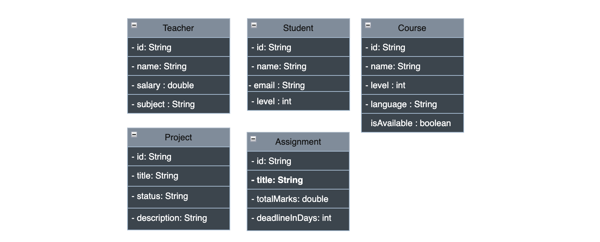

# Lab 7: Learning Management System (LMS)

## UML Diagram

---

## Data Models & Validations

### 1. Course Model
- **ID:** Cannot be null, Size must be more than 2.
- **Name:** Cannot be empty.
- **Level:** Must be a positive number (1 to 8).
- **Language:** Cannot be empty.
- **isAvailable:** Default is `false`.

### 2. Student Model
- **ID:** Cannot be null.
- **Name:** Cannot be empty.
- **Email:** Must be a valid email format.
- **Level:** Must be a positive number (1 to 8).

### 3. Teacher Model
- **ID:** Cannot be null.
- **Name:** Cannot be empty.
- **Salary:** Must be a positive number.
- **Subject:** Cannot be empty.

### 4. Project Model
- **ID:** Cannot be null.
- **Title:** Cannot be empty, minimum 5 characters.
- **Status:** Must be "Not Started", "In Progress", or "Done".
- **Description:** Cannot be empty.

### 5. Assignment Model
- **ID:** Cannot be null.
- **Title:** Cannot be empty.
- **Total Marks:** Must be a positive number (up to 100).
- **deadlineInDays:** Must be positive number.

---

## LMS Controller Endpoints

### TeacherController
- **CRUD Operations:** Create, Read, Update, and Delete teacher.

### StudentController
- **CRUD Operations:** Create, Read, Update, and Delete student.
- **Check Graduation:** Takes student id and returns "Expected to Graduate" or "Regular Student".

### CourseController
- **CRUD Operations:** Create, Read, Update, and Delete courses.
- **Enroll Student:** Checks if student level and course level match.
- **Get Courses by Level Range:** Filter courses between `min` and `max` levels.
- **Get Available Courses:** Returns only courses where `isAvailable` is true.

### ProjectController
- **CRUD Operations:** Create, Read, Update, and Delete projects.
- **Update Project Status:** Updates state (e.g., to "Done").
- **Search Projects by Title:** Get Projects by Title.
- **Get Projects by Status:** Get projects based on status.

### AssignmentController
- **CRUD Operations:** Create, Read, Update, and Delete assignments.
- **Check Student Grade:** Checks if the student's score is less than or equal to the total marks.
- **Extend Deadline:** Adds extra days to the finish date.
- **Get Hard Assignments:** Get a list of all assignments that have more than 50 marks.
